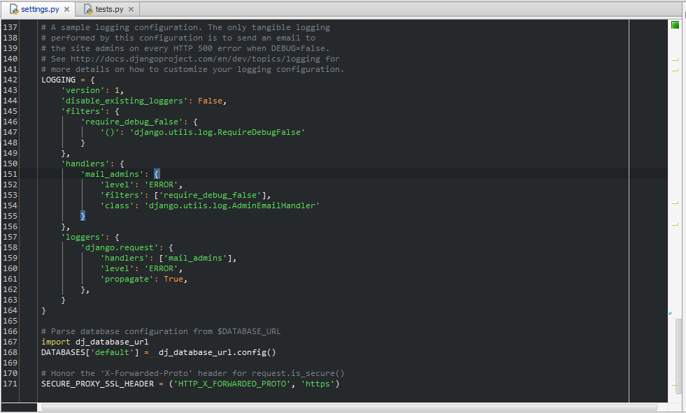
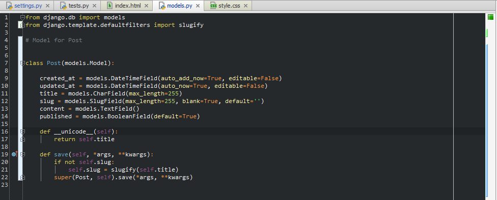
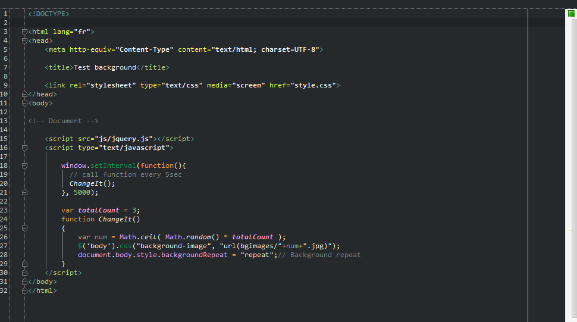
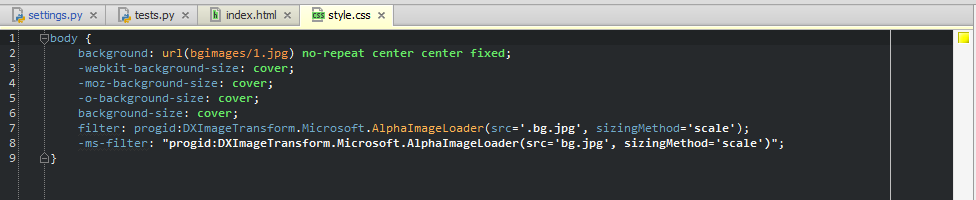

Color scheme for Pycharm IDE
====================

I am not the author of this scheme.
I've just adapted the scheme from Thinkpixellab for Sublime Text 2 available <a href="https://github.com/thinkpixellab/flatland">
here</a>.

<h4>Some Screenshots : </h4>

<h5>Python : </h5>

<h5>HTML and JavaScript :</h5>

<h5>CSS : </h5>

To install it, copy the xml into the following directory (XX = your version of Pycharm) :

<ul>
<li>MacOS X : <code>~/Library/Preferences/PyCharmXX/config/colors/</code></li>
<li>GNU/Linux : <code>/home/USER/.PyCharmXX/config/colors/</code></li>
<li>Windows 7 and newer : <code>C:\Users\USER\.PyCharmXX\config\colors</code></li>
<li>Windows XP : <code>C:\Documents and Settings\USER\.PyCharmXX\config\colors</code></li>
<ul>
